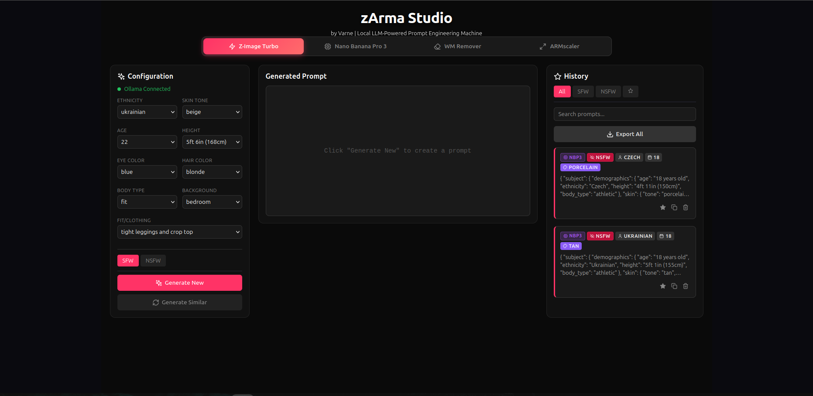

# zArma Studio


**AI-Powered Image Enhancement & Prompt Engineering Suite**

zArma Studio is a comprehensive local AI toolkit for image upscaling, restoration, watermark removal, and LLM-powered prompt generation. All processing runs locally on your machine - no cloud services, no API keys needed (except optional Gemini for image generation).



## ✨ Features

### 🖼️ ARMscaler (DiffBIR)
- **Super Resolution**: Upscale images 1x, 2x, 4x with AI enhancement
- **Face Restoration**: Restore and enhance facial features
- **Denoise**: Remove noise and grain from images
- **Quality Presets**: Turbo (8 steps), Fast (15), Balanced (25), Quality (40)
- **RTX 4090 Optimized**: TF32 precision, CUDA optimizations

### 🧹 Watermark Remover (LaMa)
- AI-powered inpainting for watermark/text removal
- Draw selection over unwanted areas
- Works with any image format

### ✍️ Prompt Generators
- **Z-Image Turbo**: Fast prompt generation for image AI
- **Nano Banana Pro 3**: Advanced prompt engineering with detailed controls
- **NSFW Support**: Toggle between SFW and NSFW modes
- **History**: Save, favorite, and export prompts

### 🔧 Technical
- **100% Local**: All AI models run on your GPU/CPU
- **Modern UI**: React-based responsive interface
- **Cross-Platform**: Linux (primary) and Windows support

## 🖥️ System Requirements

### Minimum
- **OS**: Linux (Ubuntu 22.04+ recommended) or Windows 10/11
- **RAM**: 8GB
- **Storage**: 10GB free space
- **GPU**: Optional but recommended (NVIDIA with 8GB+ VRAM)

### Recommended (for ARMscaler)
- **GPU**: NVIDIA RTX 3090/4090 (24GB VRAM)
- **RAM**: 16GB+
- **Storage**: 20GB SSD

## 🚀 Installation

### Linux (Ubuntu/Debian)

1. **Install dependencies:**
```bash
# Install Node.js 18+
curl -fsSL https://deb.nodesource.com/setup_18.x | sudo -E bash -
sudo apt-get install -y nodejs

# Install Python 3.10+
sudo apt-get install -y python3 python3-pip

# Install Ollama (for prompt generation)
curl -fsSL https://ollama.com/install.sh | sh

# Install NVIDIA drivers and CUDA (for GPU support)
# Follow: https://developer.nvidia.com/cuda-downloads
```

2. **Clone and setup:**
```bash
git clone https://github.com/Varne666/zArma-Studio.git
cd zArma-Studio/app
npm install
cd backend
pip install torch torchvision torchaudio --index-url https://download.pytorch.org/whl/cu118
bash setup_armscaler.sh
```

3. **Start Ollama:**
```bash
ollama serve
```

4. **Pull required model:**
```bash
ollama pull dolphin-mistral:7b
```

5. **Run the application:**
```bash
# Terminal 1 - Backend
cd app/backend
node server.js

# Terminal 2 - Frontend
cd app
npm run dev
```

6. **Open browser:**
Navigate to `http://localhost:3000`

### Windows

1. **Install prerequisites:**
   - [Node.js 18+](https://nodejs.org/)
   - [Python 3.10+](https://python.org/)
   - [Git for Windows](https://git-scm.com/download/win)
   - [Ollama for Windows](https://ollama.com/download/windows)

2. **Clone repository:**
```powershell
git clone https://github.com/Varne666/zArma-Studio.git
cd zArma-Studio\app
npm install
```

3. **Setup Python environment:**
```powershell
cd backend
pip install torch torchvision torchaudio --index-url https://download.pytorch.org/whl/cu118
bash setup_armscaler.sh
# Or on Windows without bash:
python setup_armscaler.py
```

4. **Start services:**
```powershell
# Terminal 1 - Start Ollama
ollama serve

# Terminal 2 - Backend
cd app\backend
node server.js

# Terminal 3 - Frontend
cd app
npm run dev
```

5. **Open browser:**
Navigate to `http://localhost:3000`

## 📖 Usage Guide

### ARMscaler - Image Upscaling

1. Click **ARMscaler** tab
2. Upload an image (drag & drop or click)
3. Select task:
   - **Super Resolution**: General upscaling
   - **Face**: Restore faces in photos
   - **Denoise**: Clean up noisy images
4. Choose upscale factor (1x, 2x, 4x)
5. Select quality preset (Turbo is fastest)
6. Click **Enhance** and wait for processing
7. Download or compare results

### Watermark Remover

1. Click **WM Remover** tab
2. Upload image
3. Draw rectangle over watermark/text
4. Click **Remove**
5. Download cleaned image

### Prompt Generator

1. Select **Z-Image Turbo** or **Nano Banana Pro 3**
2. Configure attributes (ethnicity, age, etc.)
3. Toggle SFW/NSFW mode
4. Click **Generate New**
5. Copy or save prompts to history

## 🔧 Configuration

### Environment Variables

Create a `.env` file in `app/backend/`:

```env
PORT=3001
OLLAMA_URL=http://localhost:11434
DEFAULT_MODEL=dolphin-mistral:7b
```

### GPU Memory Optimization

For GPUs with less VRAM, edit `armscaler_simple.py`:
- Reduce tile sizes (line 95-104)
- Use `--precision fp32` instead of fp16 for stability

## 🧹 Auto Cleanup

The application automatically cleans up temporary files every 30 minutes:
- Temp processing images
- Cache files
- Intermediate outputs

**Your saved prompts and favorites are NEVER deleted** - they're stored in `~/.zimage-prompts/data/history.json`

Manual cleanup:
```bash
curl -X POST http://localhost:3001/api/cleanup
```

## 🐛 Troubleshooting

### "Error connecting to backend"
- Ensure backend is running on port 3001
- Check firewall settings
- Verify Ollama is running: `curl http://localhost:11434/api/tags`

### "ARMscaler setup needed"
Run setup script:
```bash
cd app/backend
bash setup_armscaler.sh
```

### Slow performance
- Use **Turbo** quality preset (8 steps)
- For 4x upscale, expect 5-10 minutes on RTX 4090
- Close other GPU-intensive applications

### CUDA out of memory
- Reduce upscale factor (try 2x instead of 4x)
- Lower tile sizes in armscaler_simple.py
- Close browser tabs with heavy content

## 🤝 Contributing

Contributions are welcome! Please:
1. Fork the repository
2. Create a feature branch (`git checkout -b feature/amazing-feature`)
3. Commit changes (`git commit -m 'Add amazing feature'`)
4. Push to branch (`git push origin feature/amazing-feature`)
5. Open a Pull Request

## 📜 Credits

### Core Technologies
- **DiffBIR**: [XPixelGroup/DiffBIR](https://github.com/XPixelGroup/DiffBIR) - Blind Image Restoration
- **LaMa**: [saic-mdal/lama](https://github.com/saic-mdal/lama) - Large Mask Inpainting
- **Ollama**: [ollama/ollama](https://github.com/ollama/ollama) - Local LLM inference
- **React + Vite**: Frontend framework
- **Express.js**: Backend API

### Models
- Stable Diffusion v2.1 (for DiffBIR)
- BSRNet, SwinIR (restoration models)
- LaMa (inpainting)

### Author
- **Arma** (@varne) - Creator & Developer
  - Discord: `ude1`
  - GitHub: [@Varne666](https://github.com/Varne666)

### Special Thanks
- Contributors and testers

## 📄 License

This project is licensed under the MIT License - see [LICENSE](LICENSE) file.

**Note**: This software is for educational and research purposes. Users are responsible for complying with local laws and regulations.

## 🔗 Links

- [GitHub Repository](https://github.com/Varne666/zArma-Studio)
- [Report Issues](https://github.com/Varne666/zArma-Studio/issues)
- [Ollama Models](https://ollama.com/library)

---

Made with ❤️ by the zArma Studio Team
